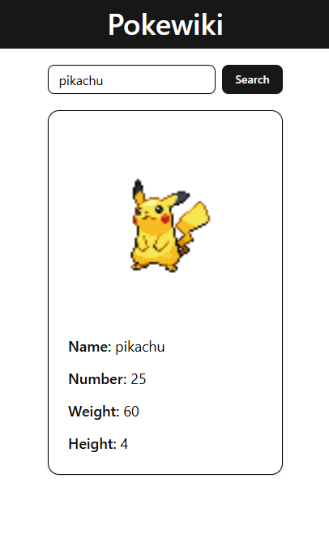

# PokeWiki - Pokedex React App

This project is a front-end application developed with React that consumes the [PokéAPI](https://pokeapi.co/) to display information about a specific Pokémon. It was created as part of the exercise "PDF 3 - Let's develop a Pokedex?"

## Features

- **Pokémon Search:** Type the name of a Pokémon to fetch its information.
- **Data Display:** Shows the Pokémon's name, number, weight, and height.
- **Visual Feedback:** Displays "Loading..." while fetching data and "Pokemon not found!" if the Pokémon doesn't exist.

## Technologies Used

- **React** with TypeScript
- **Tailwind CSS**
- **Vite**

## Project Structure

The project is structured as follows:

```
frontend/
├── public/
│   └── assets/
│       ├── screenshot-app-1.png
│       └── screenshot-app-2.png
├── src/
│   ├── components/
│   │   └── ui/
│   │       ├── button.tsx
│   │       ├── input.tsx
│   │       └── card.tsx
│   ├── App.tsx
│   ├── main.tsx
│   └── index.css
├── package.json
└── README.md
```

## How to Run

1. **Clone the repository:**

   ```bash
   git clone https://github.com/YOUR_USERNAME/pokedex-app.git
   ```

2. **Navigate to the project folder:**

   ```bash
   cd pokedex-app/frontend
   ```

3. **Install dependencies:**

   ```bash
   npm install
   ```

4. **Run the application:**

   ```bash
   npm run dev
   ```

## Hosting

The application is hosted and available online. You can access it [here](https://your-deployed-app-link.com).

## Screenshots

Include some screenshots to demonstrate the application's functionality:

  
  
